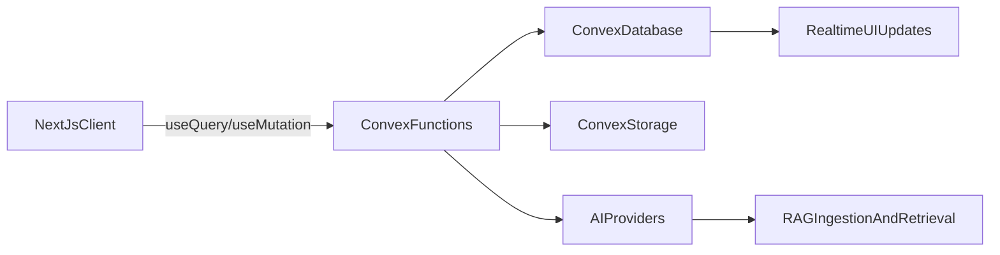

# Next.js + Convex Migration Plan

## Scope and Defaults

- Deliver a **production-oriented phased migration**: foundation first, then feature-parity modules in sequence to reduce risk.
- Use a **Convex-first architecture** for data, realtime, function orchestration, and uploads.
- Use **Convex actions** for external AI/provider calls and RAG ingestion/query workflows.
- Keep current anonymous-device workflow as baseline, with optional auth hardening as a follow-up.

## Current-to-Target Mapping

- Frontend currently lives in Expo routes under `app/` (for example `app/(tabs)/index.tsx`, `app/submit.tsx`, `app/plate/[licensePlate].tsx`).
- Backend currently lives in tRPC/Express/Drizzle (`server/routers.ts`, `server/db.ts`, `drizzle/schema.ts`).
- Target:
  - Next.js App Router for web UX and route handlers.
  - Convex schema + queries/mutations/actions replacing tRPC+Drizzle data paths.
  - Convex reactive subscriptions replacing polling/delta sync.

## Workstreams

### 1) Bootstrap Next.js + Convex Runtime

- Create Next.js app shell and move web-capable UI patterns from Expo routes.
- Add Convex client/provider and environment wiring.
- Replace Expo-specific runtime APIs and navigation assumptions.
- Key files:
  - Existing references: `app/_layout.tsx`, `app/(tabs)/_layout.tsx`, `lib/trpc.ts`
  - New targets: `src/app/layout.tsx`, `src/app/page.tsx`, `src/lib/convex-client.ts`

### 2) Define Convex Data Model and Index Strategy

- Port tables from `drizzle/schema.ts` into `convex/schema.ts`.
- Preserve entities: sightings, votes, plates/materialized stats, watch subscriptions.
- Add indexes for hot paths: plate lookup, createdAt recency, geo-bucket lookups, credibility filtering.
- Add derived-field strategy for performance (e.g., normalized plate, geo hash/bucket).
- Key files:
  - Existing reference: `drizzle/schema.ts`
  - New target: `convex/schema.ts`

### 3) Replace Server API Surface with Convex Functions

- Migrate each router domain from `server/routers.ts` into Convex modules:
  - sightings, votes, plates, trending, convoy, anomaly, export, proximity.
- Split by responsibility:
  - queries for reads
  - mutations for writes
  - actions for external I/O (AI, geocoding, file transforms)
- Key files:
  - Existing references: `server/routers.ts`, `server/db.ts`
  - New targets: `convex/sightings.ts`, `convex/votes.ts`, `convex/plates.ts`, `convex/proximity.ts`, `convex/export.ts`, `convex/anomaly.ts`

### 4) Realtime Migration

- Remove interval polling and delta cache logic; subscribe directly to Convex queries from UI.
- Replace cache reconciliation in `lib/sightings-cache.ts` with reactive query composition.
- Keep optimistic UI where needed for voting/submit interactions.
- Key files:
  - Existing references: `app/(tabs)/index.tsx`, `lib/sightings-cache.ts`
  - New target areas: `src/features/sightings/*`, `src/hooks/useSightingsRealtime.ts`

### 5) Geolocation and Proximity

- Keep browser geolocation capture in UI.
- Add Convex-side geo query strategy (grid/geohash + bounded filtering + exact distance pass).
- Migrate nearby/proximity endpoints and watched-plate alert checks to Convex queries/actions.
- Key files:
  - Existing references: `app/camera.tsx`, `app/submit.tsx`, `hooks/use-proximity-alerts.ts`
  - New targets: `convex/geo.ts`, `convex/proximity.ts`, `src/features/map/*`

### 6) File Upload and Media Handling

- Replace current `storagePut` proxy flow with Convex upload URLs and storage APIs.
- Persist upload metadata in sightings documents.
- Add server-side validation for mime/size and abuse-safe keying conventions.
- Key files:
  - Existing reference: `server/storage.ts`
  - New targets: `convex/files.ts`, `src/lib/upload.ts`, `src/features/submit/*`

### 7) AI Agents + RAG

- Create Convex action-based AI orchestration module for ALPR + vehicle analysis.
- Introduce RAG pipeline:
  - document/file ingestion
  - chunking + embedding
  - indexed retrieval + citation payload
  - agent tool-calling wrapper for query flows
- Start with one practical RAG domain (e.g., plate-history intelligence + operator notes) and expand.
- Key files:
  - Existing references: `server/_core/llm.ts`, `server/_core/imageGeneration.ts`, `server/_core/voiceTranscription.ts`
  - New targets: `convex/ai.ts`, `convex/agents.ts`, `convex/rag.ts`, `convex/ragIngest.ts`

### 8) Route-by-Route UI Port

- Port routes from Expo file tree to Next App Router:
  - map home, reports list, camera capture, submit, sighting detail, plate detail, widget.
- Replace Expo UI primitives with web components while preserving behavior and data contracts.
- Key files:
  - Existing references: `app/(tabs)/index.tsx`, `app/(tabs)/sightings.tsx`, `app/camera.tsx`, `app/submit.tsx`, `app/sighting/[id].tsx`, `app/plate/[licensePlate].tsx`, `app/widget.tsx`
  - New targets: `src/app/page.tsx`, `src/app/sightings/page.tsx`, `src/app/camera/page.tsx`, `src/app/submit/page.tsx`, `src/app/sighting/[id]/page.tsx`, `src/app/plate/[licensePlate]/page.tsx`, `src/app/widget/page.tsx`

### 9) Validation, Security, and Ops Baseline

- Add consistent argument validation across Convex public functions.
- Ensure authenticated/unauthenticated boundaries are explicit.
- Add error semantics and retry-safe mutations.
- Add rate-limiting and basic abuse controls for uploads and AI actions.

### 10) Verification and Cutover

- Build migration verification matrix against existing behavior from `todo.md` features.
- Add integration tests for critical flows: submit sighting, vote, plate timeline, nearby query, AI extraction, RAG query, upload path.
- Run staged cutover:
  1. Next+Convex dual-run
  2. feature flags
  3. full switch

## Rollout Sequence

1. Foundation: Next.js + Convex bootstrapping.
2. Data model + sightings/votes core.
3. Realtime map/list parity.
4. Upload pipeline.
5. AI analysis + ALPR.
6. RAG + agent orchestration.
7. Remaining advanced modules (convoy/anomaly/export/proximity alerts).
8. Final verification and decommission legacy server paths.

